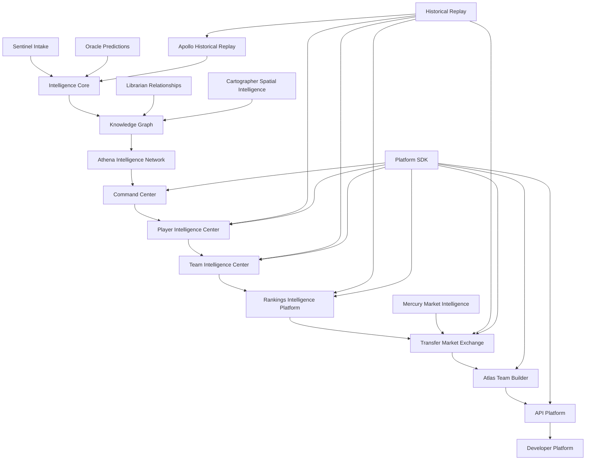

# Cross-Module Relationship Diagram

This document shows how Portal Pulse products connect as a single intelligence platform. The diagram is product-level, not an implementation dependency graph.

## Relationship Overview

- **Intelligence Core** is the reasoning gate for significance, confidence, conflicts, explanations, and publication readiness.
- **Knowledge Graph** stores and explains relationships between entities, claims, sources, predictions, visits, teams, coaches, places, and timelines.
- **Athena Intelligence Network** coordinates specialized agents, but agents propose findings rather than publish conclusions.
- **Command Center** is the flagship user surface where approved intelligence becomes a live operating view.
- **Player Intelligence Center** and **Team Intelligence Center** provide deep entity-specific context.
- **Rankings Intelligence Platform** turns approved signals into explainable ranked products.
- **Transfer Market Exchange** packages market movement, momentum, and activity into a daily-use intelligence product.
- **Atlas** turns team and roster intelligence into coach-facing scenario planning and front-office simulation.
- **API Platform** exposes safe, versioned, confidence-aware intelligence for internal and future external consumers.
- **Developer Platform** educates and onboards future API and data partners.

## Cross-Module Product Rules

- No module independently decides whether an unsourced claim is true.
- No agent publishes directly to UI, API, notifications, or enterprise products.
- No score or recommendation should be shown without an Explain This path.
- Historical Replay should preserve what Portal Pulse believed at the time, even if later information changes.
- The Platform SDK should be the default integration surface for future web, mobile, API, and enterprise products.
