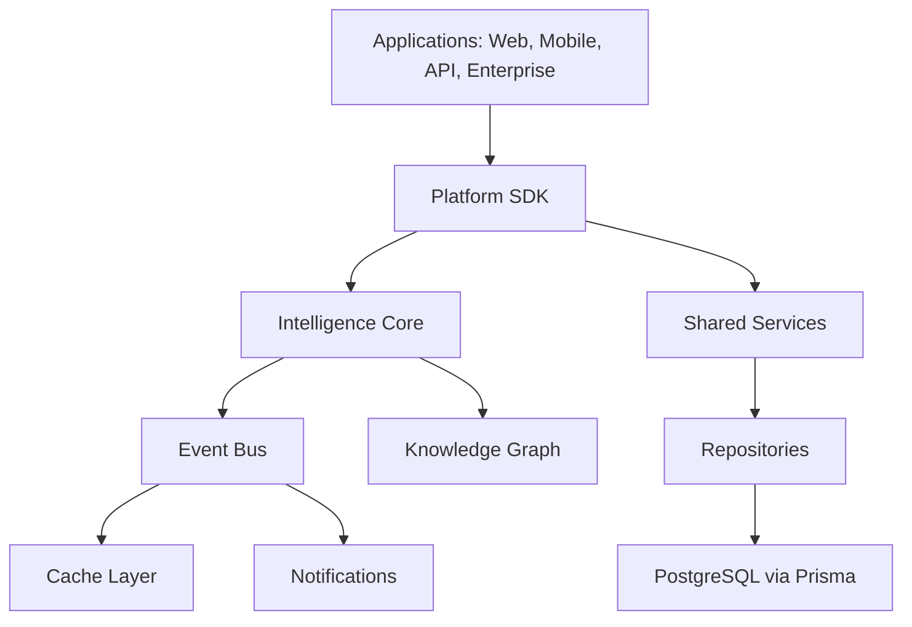
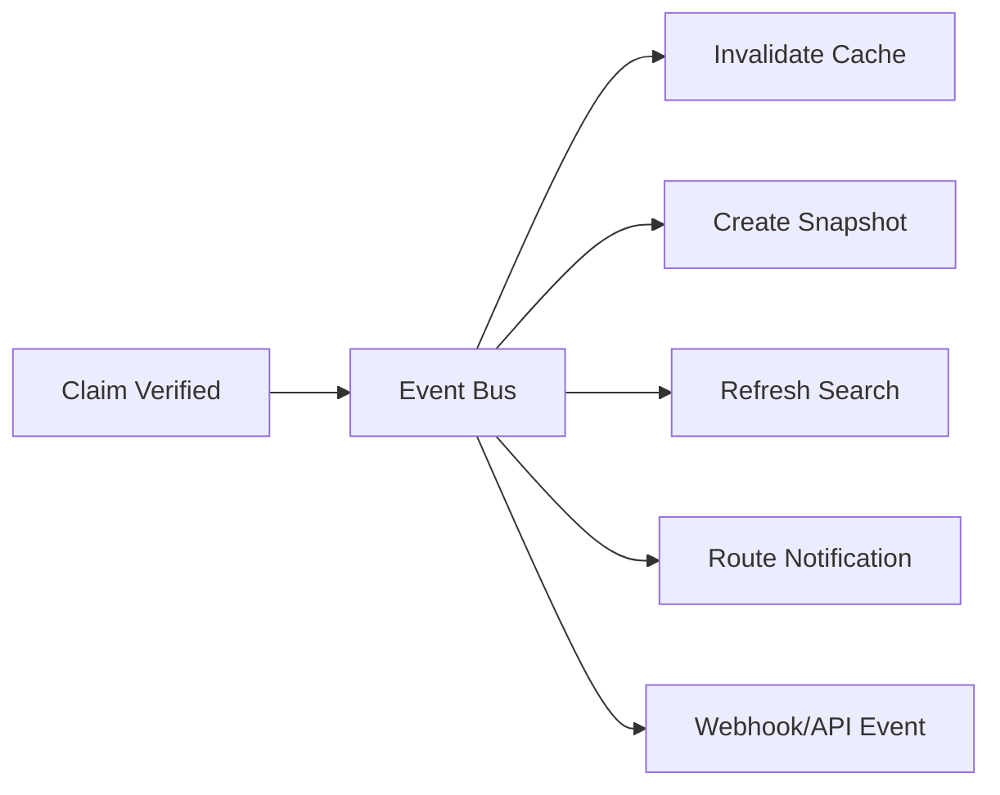
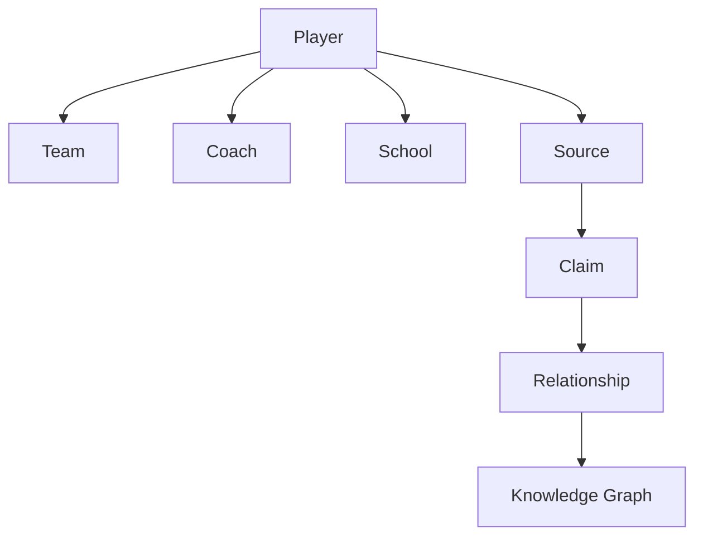
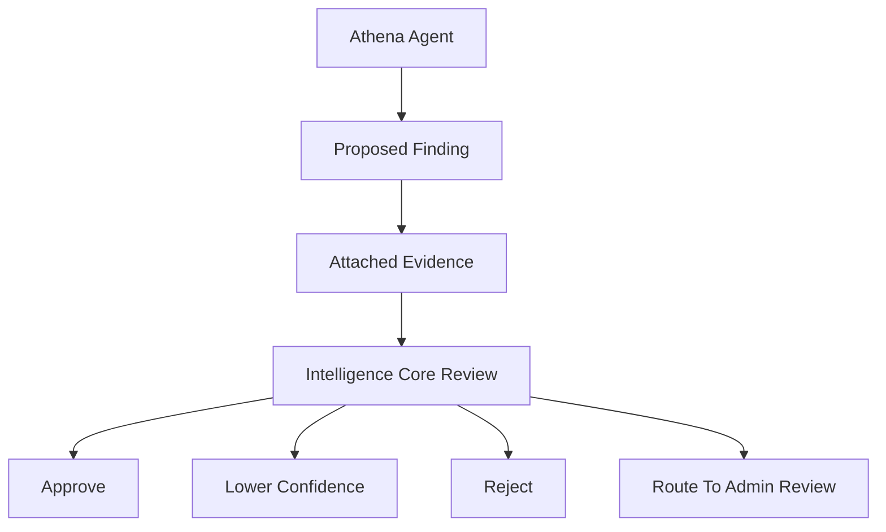
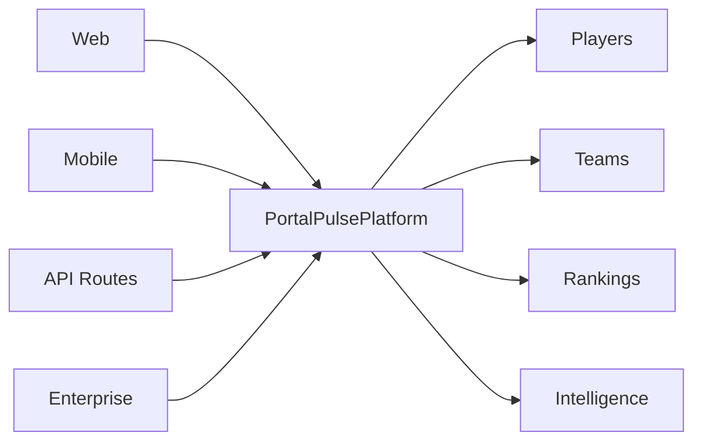
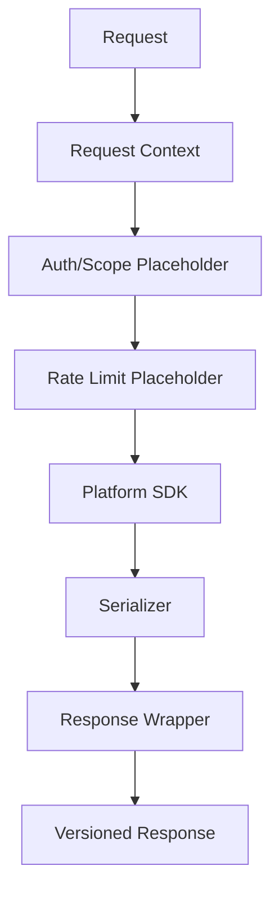
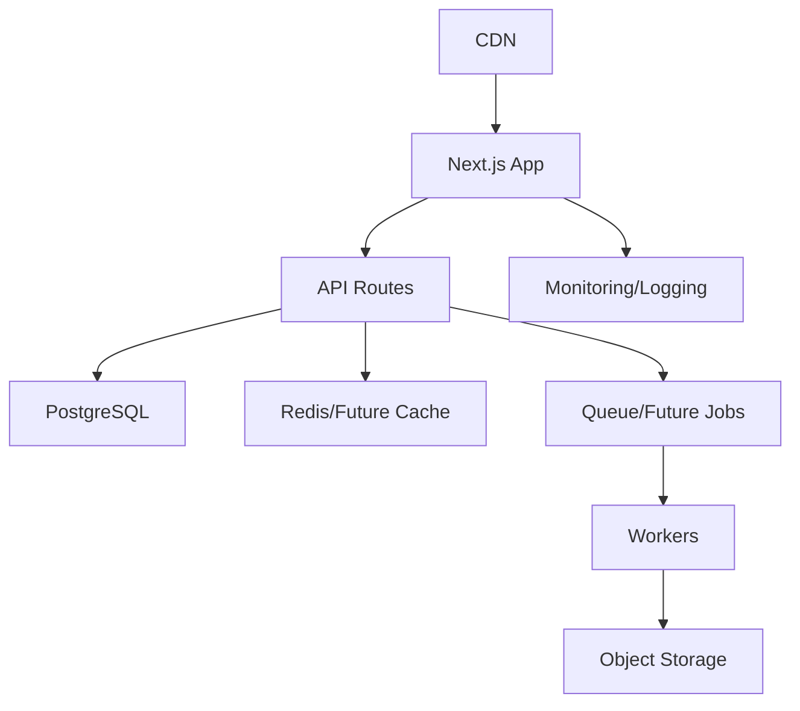

# Portal Pulse Technical Architecture Bible

## Master Technical Blueprint

The Portal Pulse Technical Architecture Bible is the authoritative engineering reference for the platform. It explains how the system is designed, why the boundaries exist, and how future engineers should extend the architecture without weakening trust, maintainability, scalability, or explainability.

This is system architecture documentation. It is not a line-by-line code reference.

Current status: Portal Pulse has a broad mock/demo and architecture-first foundation. Many platform layers, routes, services, SDK modules, AI agent shells, and documentation systems exist in scaffold or mock-backed form. Production ingestion, verified live data, authentication, real-time infrastructure, operational monitoring, and enterprise workflows are future implementation areas.

Engineering implementation standards live in `engineering-standards/ENGINEERING_STANDARDS.md`. The Technical Architecture Bible explains the system shape; the Engineering Standards Manual explains how contributors should write, review, test, document, secure, and ship changes inside that architecture.

## Architecture North Star

Portal Pulse is an intelligence operating system for college athletics. The architecture must preserve a hard separation between:

1. Public information
2. Source records
3. Claims
4. Evidence
5. Intelligence
6. Predictions
7. Recommendations
8. User-facing products

No page, widget, API route, notification, or AI agent should independently decide significance, confidence, or publication readiness. Those responsibilities belong to shared platform services, especially the Intelligence Core.

---

# Section 1 — Platform Overview

Portal Pulse is organized as a layered platform rather than a collection of isolated pages.

## Platform SDK

The Platform SDK lives under `platform/` and is the preferred integration surface for future web, mobile, API, AI, analytics, and enterprise products.

The SDK composes domain modules such as:

- players
- teams
- rankings
- predictions
- timeline
- NIL
- visits
- insights
- search
- notifications
- knowledge graph
- analytics
- history
- market
- maps
- roster
- command center
- AI policy
- intelligence
- Athena

Engineering rule: future product surfaces should call SDK modules or shared services before adding local business logic.

## Intelligence Core

The Intelligence Core is the shared reasoning layer. It handles:

- signal collection
- evidence grouping
- confidence calculation
- conflict detection
- importance scoring
- reasoning
- explanation generation
- recommendation generation
- delivery gating

The Core does not create facts. It organizes verified or reviewable claims and signals into explainable intelligence.

## Event Bus

The event bus is prepared under `platform/events`. It is the future mechanism for broadcasting domain changes across the platform.

Example future events:

- `PlayerUpdated`
- `ClaimVerified`
- `PredictionChanged`
- `VisitAdded`
- `NILUpdated`
- `RankingChanged`
- `TeamUpdated`
- `TimelineUpdated`
- `InsightGenerated`
- `HistoricalSnapshotCreated`

The intended production role of the event bus is cache invalidation, notification routing, historical snapshots, analytics refreshes, webhook delivery, and audit trails.

## Knowledge Graph

The Knowledge Graph is the relationship memory of Portal Pulse. It connects entities, claims, sources, visits, predictions, timeline events, regions, teams, coaches, players, schools, and conferences.

It should power relationship context across player pages, team pages, Athena, Oracle, Sentinel, Command Center, maps, TMX, APIs, and enterprise products.

## AI Network

The Athena Intelligence Network contains specialized AI analyst shells:

- Athena — Chief Intelligence Officer
- Oracle — Prediction Specialist
- Sentinel — Intelligence Intake Coordinator
- Mercury — Transfer Market Analyst
- Atlas — Roster Intelligence Analyst
- Apollo — Historical Analyst
- Librarian — Knowledge Graph Analyst
- Cartographer — Spatial Intelligence Analyst
- Hermes — Notification Intelligence
- Archivist — Historical Replay Analyst
- Vega — Basketball Analyst

Agents propose findings. They do not publish. Intelligence Core remains the decision authority.

## APIs

The API Platform prepares versioned, safe, source-aware, confidence-aware responses for internal consumers and future external developers.

API surfaces should use serializers and response wrappers to avoid exposing unsafe internal fields, admin notes, raw copied article text, credentials, private NIL information, or unreviewed claims as facts.

## Design Operating System

PP-DOS, the Portal Pulse Design Operating System, defines the visual and interaction language for every product surface. Engineering should treat it as a product constraint, not decoration.

Trust indicators, confidence states, motion, accessibility, dashboard density, Intelligence Stream, Explain This, and workspace layouts should follow the design system.

## Shared Services

Shared services live across `server/`, `platform/`, and `lib/`.

Service responsibilities:

- isolate business logic
- protect UI from persistence details
- normalize domain outputs
- preserve type boundaries
- keep AI review-gated
- centralize trust and confidence logic

---

# Section 2 — Data Flow

The intended intelligence flow is:

```text
Public Information
  ↓
Sentinel Intake
  ↓
Normalization
  ↓
Evidence
  ↓
Knowledge Graph
  ↓
Intelligence Core
  ↓
AI Agents
  ↓
Platform SDK
  ↓
Applications
  ↓
Users
```

## Public Information

Public information may come from official school releases, player public statements, coach statements, verified reporters, public news articles, RSS feeds, compliant public social content, podcast transcripts where available, and legally accessible summaries or headlines.

Portal Pulse must not bypass paywalls, logins, CAPTCHAs, robots.txt, private databases, or compliance restrictions.

## Sentinel Intake

Sentinel coordinates the intake pipeline. It detects source items, checks compliance, scores priority, detects duplicates, scans conflicts, creates claim candidates, and routes uncertain items to review.

Sentinel never confirms facts and never publishes directly.

## Normalization

Normalization converts raw source metadata or parser output into consistent internal structures:

- canonical URLs
- source type
- author and publisher
- published and retrieved timestamps
- detected entities
- extracted claim candidates
- duplicate fingerprints
- compliance flags

## Evidence

Evidence connects claims, sources, historical context, contradictions, confidence factors, and timestamps. No intelligence output should exist without evidence.

Evidence can include supporting claims, supporting sources, contradicting claims, contradicting sources, source reliability, recency, and historical consistency.

## Knowledge Graph

The graph links normalized entities and evidence into relationship context. It answers how players, teams, coaches, schools, conferences, claims, sources, visits, predictions, and regions are connected.

## Intelligence Core

The Core evaluates evidence, confidence, conflicts, importance, reasoning, and publication readiness. It is the central gate for what can become surfaced intelligence.

## AI Agents

AI agents consume signals and context to propose findings, explanations, summaries, or recommendations. They attach evidence and confidence reasoning, then submit proposals back to the Intelligence Core.

## Platform SDK

The SDK packages approved or mock-approved intelligence into reusable interfaces for applications, APIs, mobile, analytics, dashboards, and enterprise products.

## Applications

Applications include Command Center, Player Intelligence Center, Team Intelligence Center, Rankings, TMX, Atlas, Athena, Maps, Replay, API Platform, Developer Platform, and future mobile products.

## Users

Users receive confidence-aware, source-aware, timestamped, and explainable intelligence. The UI should make uncertainty visible rather than hiding it.

---

# Section 3 — Knowledge Graph

The Knowledge Graph is designed as a PostgreSQL-compatible abstraction today, with future optional graph database support if scale and query complexity require it.

## Entities

Core graph entities include:

- Player
- Team
- School
- Conference
- Coach
- Position
- Sport
- HighSchool
- RecruitingClass
- NILCollective
- Brand
- Source
- Claim
- Visit
- Prediction
- TimelineEvent
- Region
- State
- City
- TransferClass
- RosterSpot

Each entity should include an ID, entity type, display name, aliases, confidence score, source IDs, timestamps, and mock/inferred status where applicable.

## Relationships

Relationship examples include:

- player attended school
- player played for team
- player entered portal
- player committed to team
- player visited team
- player linked to coach
- player teammate of player
- team member of conference
- coach worked at school
- team needs position
- team competing for player
- source supports claim
- claim supports relationship
- prediction involves player or team
- timeline event involves entity

Relationships must include direction, strength, confidence, evidence IDs, source IDs, first seen, last seen, status, inferred flag, and mock flag.

## Evidence

Graph relationships should be evidence-backed. Evidence may support, weaken, or contradict a relationship. Inferred relationships must be clearly labeled and should never be treated as facts without verification.

## Confidence

Graph confidence should consider:

- source reliability
- independent source count
- official confirmation
- recency
- directness
- repeated mentions
- contradiction count
- relationship type
- historical consistency

## Queries

Reusable graph queries should support:

- player network
- team network
- coach network
- recruiting pipelines
- shared targets
- players connected to a coach
- players from a region
- teams competing for a player
- conference transfer flow
- relationship paths
- strongest relationships
- weak or conflicting relationships

## Relationship Scoring

Relationship strength labels:

- Strong
- Moderate
- Weak
- Inferred
- Conflicting
- Unknown

Scores should remain explainable and should not overwrite evidence history.

## Inference Philosophy

Inference is allowed as a proposal, not a fact. Librarian may infer that two entities are likely connected, but the Intelligence Core must verify evidence, confidence, conflicts, and publication readiness.

---

# Section 4 — AI Architecture

Portal Pulse AI is a proposal network. It is not an autonomous publishing system.

## Core AI Rule

No AI agent may publish a conclusion directly. Agents may propose findings. The Intelligence Core verifies evidence, applies confidence scoring, checks conflicts, and determines what can surface.

## Athena

Athena is the Chief Intelligence Officer. Athena coordinates specialized agents, creates briefings, summarizes what matters, and explains context. Athena does not invent facts and does not bypass the Core.

## Oracle

Oracle is the Prediction Specialist. It explains probability movement, supporting signals, risk factors, uncertainty, and what could change a projection. Predictions are projections, never facts.

## Sentinel

Sentinel is the Intelligence Intake Coordinator. It handles compliant source intake, normalization, duplicate detection, conflict scanning, priority scoring, and claim candidate routing.

## Mercury

Mercury is the Transfer Market Analyst. It explains movement, activity, momentum, demand, competition, position scarcity, and source volume. The market framing is analytical and must never imply athletes are financial assets.

## Atlas

Atlas is the Roster Intelligence Analyst. It powers Team Builder, roster scenarios, Roster DNA, Team Genome, Roster Chemistry, Scholarship IQ, Transfer Fit, opportunities, and strategy recommendations. Outputs must be labeled mock, simulated, projected, or assumption-based as appropriate.

## Apollo

Apollo is the Historical Analyst. It preserves what Portal Pulse knew at a point in time, what was predicted, confidence at the time, what changed later, and prediction accuracy.

## Librarian

Librarian is the Knowledge Graph Analyst. It proposes relationships, detects duplicate entities, explains networks, and identifies weak or conflicting relationships.

## Cartographer

Cartographer is the Spatial Intelligence Analyst. It visualizes verified graph-backed geography, movement flows, regional patterns, maps, heat zones, and replay hooks.

## Hermes

Hermes is the future Notification Intelligence agent. It should route meaningful, preference-aware alerts without flooding users with raw updates.

## Archivist

Archivist is the future historical memory agent. It should support long-term records, source retention, versioning, and replay context.

## Agent-to-Core Flow

```text
Agent observes signals
  ↓
Agent proposes finding
  ↓
Agent attaches evidence and confidence reasoning
  ↓
Intelligence Core verifies evidence
  ↓
Core checks conflicts
  ↓
Core approves, rejects, lowers confidence, or routes to admin review
  ↓
Approved intelligence can surface through SDK, UI, API, or notifications
```

---

# Section 5 — Platform SDK

The Platform SDK is the shared integration layer.

## Shared Services

The SDK should expose stable methods for:

- player intelligence
- team intelligence
- rankings
- command center snapshots
- predictions
- NIL
- visits
- timeline
- knowledge graph
- AI insights
- search
- notifications
- history
- maps
- roster intelligence
- market intelligence
- API contracts

## Versioning

SDK interfaces should be versioned when contracts become external or mobile-facing. Future `v2` modules should coexist with `v1` modules where backwards compatibility matters.

## Event Model

Domain changes should eventually publish events. Events should drive:

- cache invalidation
- notification routing
- historical snapshots
- search indexing
- analytics refresh
- webhook delivery
- audit logging

## Interfaces

SDK interfaces should return product-ready domain objects, not raw database rows. They should preserve source counts, confidence, timestamps, mock flags, and explainability payloads.

## Reuse Philosophy

If two product surfaces need the same reasoning, the logic belongs in the platform. Duplication creates drift, inconsistent confidence, and conflicting user experiences.

---

# Section 6 — API Platform

The API Platform prepares Portal Pulse to become data infrastructure for internal products and future external consumers.

## Versioning

API routes should be versioned, beginning with `/api/v1`. Contracts, serializers, and response wrappers should be version-aware.

## Serialization

Serializers transform internal domain objects into safe API responses. They should:

- remove unsafe internal fields
- include source counts
- include confidence
- include timestamps
- include mock/demo labels
- include disclaimers where needed
- avoid exposing admin-only data

## Response Wrappers

Standard API response shape:

```json
{
  "data": {},
  "meta": {
    "version": "v1",
    "generatedAt": "",
    "isMock": true,
    "sourceCount": 0,
    "confidenceScore": 0,
    "requestId": ""
  },
  "errors": []
}
```

List responses should include pagination, filters applied, sort, and total placeholders.

## Authentication Roadmap

Future API auth should support:

- API keys
- user tokens
- partner tokens
- premium access
- enterprise scopes
- admin scopes

Current auth modules are placeholders and should not be treated as production security.

## Rate Limiting

Future rate-limit tiers may include:

- free
- pro
- media partner
- enterprise
- internal

Rate limiting should be applied before public API launch.

## Developer Platform Vision

The Developer Platform should provide docs, examples, sandbox data, SDK downloads, webhook previews, usage dashboards, and partner onboarding.

The API should never expose raw copied articles, private NIL data, unsafe internal IDs, credentials, unsupported scraped data, or unreviewed sensitive claims as facts.

---

# Section 7 — Infrastructure

This section describes the intended production architecture. Some elements already exist as local project structure; others are future architectural intentions.

## Next.js

Next.js App Router is the web application foundation. Server components should be preferred where they reduce client payload and keep data fetching close to the platform layer.

## PostgreSQL

PostgreSQL is the primary relational data store target. It should hold durable entities, claims, sources, timelines, users, teams, rankings, snapshots, and audit records.

## Prisma

Prisma is the ORM layer and should mediate database access through repositories or server-side services. UI components should not import Prisma directly.

## Redis

Redis or an equivalent cache is a future infrastructure target for command center snapshots, rankings, search results, player profiles, team dashboards, API responses, and rate-limit state.

## Object Storage

Object storage is intended for future media, exports, generated reports, snapshots, documents, audio briefings, and bulk data products.

## CDN

A CDN should serve static assets, public media, cached API-adjacent responses where safe, and future embeddable widgets.

## Queue System

A queue system is intended for ingestion jobs, AI extraction, source checks, snapshot creation, notification delivery, webhook dispatch, report generation, and long-running analytics.

## Background Jobs

Background jobs should be idempotent, observable, retryable, and safe. Jobs should not bypass compliance checks or Intelligence Core review gates.

## Monitoring

Production monitoring should track uptime, latency, error rates, queue health, ingestion throughput, API usage, cache hit rates, and user-facing performance.

## Logging

Logs should support debugging and auditability without leaking secrets, credentials, private NIL information, or sensitive user data.

## CI/CD

CI/CD should eventually run type checks, linting, unit tests, contract tests, API tests, accessibility checks, build verification, Prisma validation, and deployment checks before production release.

---

# Section 8 — Security

Security is a product principle, not only an implementation detail.

## Authentication Philosophy

Public experiences may remain anonymous. Admin, professional, coach, enterprise, and API experiences require authentication before production launch.

## Authorization

Authorization should be role- and scope-aware:

- public user
- premium user
- media user
- coach/staff user
- athletic department admin
- API consumer
- partner
- internal admin
- system job

## Secrets

Secrets must live in environment-managed secret storage, never in source code, docs, logs, or API responses.

## Audit Logging

Audit logs should capture high-impact changes:

- claim approval
- confidence changes
- source reliability overrides
- admin review decisions
- NIL review decisions
- prediction publication
- user permission changes
- API key creation or revocation

## Privacy

Portal Pulse must protect private NIL information, private team notes, private evaluations, unpublished roster data, user preferences, and enterprise workflows.

## Public Information Handling

Public availability does not automatically grant permission to republish. The platform should summarize, cite, and structure information without copying full articles or bypassing rights.

## Compliance Mindset

Compliance checks should exist before ingestion, parsing, AI extraction, API exposure, or publication. Unclear compliance status should route to review.

---

# Section 9 — Testing

Testing should protect both behavior and trust.

## Unit Testing

Unit tests should cover utilities, formatters, validators, scoring functions, serializers, and isolated service logic.

## Integration Testing

Integration tests should cover service-to-repository flows, API route responses, SDK module calls, and major product data composition paths.

## Contract Testing

Contract tests should validate Platform SDK and API response shapes so future consumers are not broken silently.

## Accessibility Testing

Accessibility checks should cover keyboard navigation, focus states, color contrast, ARIA labels, reduced motion, and responsive behavior.

## Performance Testing

Performance tests should monitor dashboard payload size, API latency, database query plans, cache behavior, and mobile responsiveness.

## Regression Testing

Regression tests should preserve high-trust behavior:

- predictions are not facts
- NIL values are labeled
- mock data is labeled
- low-confidence items route to review
- conflicting sources are flagged
- AI agents do not publish directly

---

# Section 10 — Scalability

Portal Pulse should evolve through clear stages.

## Prototype

The current state emphasizes architecture, mock data, UI foundations, platform boundaries, and documentation. The goal is learning and system shape, not production completeness.

## Beta

Beta should introduce real database-backed flows, authentication for protected routes, initial verified source workflows, admin review, foundational tests, and controlled user feedback.

## Production

Production requires reliable ingestion, verified data pipelines, secure auth, rate limits, caching, monitoring, audit logs, backups, incident response, and clear operating processes.

## Enterprise

Enterprise requires role-based access, private workspaces, usage tracking, SLAs, export controls, partner contracts, admin tooling, and strict data separation.

## Global Platform

Global scale may require multi-region deployment, advanced caching, dedicated search, graph-optimized storage, data residency considerations, international sports support, and mature observability.

---

# Section 11 — Future Expansion

The architecture is designed to support expansion without rebuilding the foundation.

## Portal Pulse Labs

Labs can test experimental intelligence products, model concepts, partner pilots, and early workflows behind clear labels and controlled access.

Labs outputs must remain separate from verified intelligence. Simulations, projections, mock data, scenario analysis, and user configurations cannot become surfaced facts unless future workflows route them through the Intelligence Core with evidence, confidence scoring, conflict checks, and review status.

## Digital Twin

Digital Twin products may simulate rosters, teams, conferences, market movement, and scenario outcomes. Simulations must remain labeled as assumption-based and must not be confused with predictions or facts.

The Program Intelligence Workspace is the first user-facing program-level surface powered internally by the Digital Twin Engine. It aggregates mock program state across roster, market, history, graph, rankings, timeline, evidence, and AI modules while labeling each section as verified information, analysis, historical context, predictions, or simulations.

## Coach Workspace

Coach Workspace should provide protected professional workflows: private notes, recruiting boards, roster planning, visit planning, Transfer Fit, Scholarship IQ, and collaboration.

## GM Workspace

GM Workspace should support personnel departments with roster construction, scholarship strategy, portal strategy, multi-year forecasts, and enterprise dashboards.

## Mobile

Mobile should consume Platform SDK and API contracts, not separate business logic. Mobile experiences should prioritize watchlists, alerts, briefings, search, and compact intelligence cards.

## Enterprise

Enterprise expansion requires permissions, audit logs, private data separation, API contracts, usage tracking, billing, exports, support workflows, and deployment reliability.

## Future Sports

The architecture should support all college sports by keeping sport, position, roster, depth chart, ranking, and statistical concepts extensible.

## International Expansion

International expansion is a long-term possibility. It would require localization, jurisdiction-specific compliance, sport-specific data models, and source trust systems adapted to each market.

---

# Architecture Diagrams

These diagrams are placeholders for future visual documentation. They should be expanded as systems move from mock/demo architecture to production operations.

## System Architecture



## Event Flow



## Knowledge Graph



## AI Orchestration



## Platform SDK



## API Flow



## Deployment Topology



---

# Engineering Decision Checklist

Before adding a new system, ask:

1. Does this belong in the Platform SDK, a shared service, or a product-specific component?
2. Does it preserve the separation between fact, claim, evidence, intelligence, prediction, and recommendation?
3. Does it expose confidence, source count, timestamp, and explanation where needed?
4. Does it avoid duplicating reasoning already owned by the Intelligence Core?
5. Does it preserve history instead of overwriting important state?
6. Does it keep UI away from raw database logic?
7. Does it protect private, admin, NIL, and compliance-sensitive data?
8. Does it create observable, testable behavior?
9. Does it keep planned future systems clearly labeled as future?
10. Does it align with the Portal Pulse Constitution, Product Bible, Founder Book, and PP-DOS?

---

# Related Canonical Documents

- `docs/PORTAL_PULSE_CONSTITUTION.md`
- `founder-book/PORTAL_PULSE_FOUNDER_BOOK.md`
- `product-bible/PORTAL_PULSE_PRODUCT_BIBLE.md`
- `design-system/PORTAL_PULSE_DESIGN_OS.md`
- `docs/ARCHITECTURE.md`
- `docs/PLATFORM_SDK.md`
- `docs/INTELLIGENCE_CORE.md`
- `docs/API_PLATFORM.md`
- `docs/KNOWLEDGE_GRAPH.md`
- `docs/DATABASE.md`
- `docs/INGESTION.md`
- `engineering-standards/ENGINEERING_STANDARDS.md`
- `docs/PORTAL_PULSE_LABS.md`
- `docs/PROGRAM_INTELLIGENCE_WORKSPACE.md`
